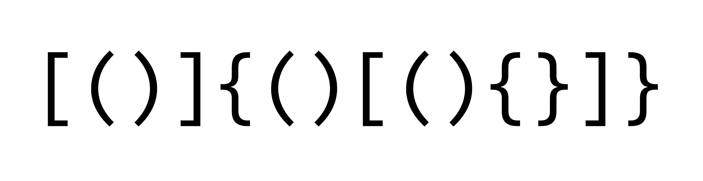

## Задача об удалении минимального количества скобок из СП с целью получения ПСП

### Условие:
Дана строка, состоящая из открывающих и закрывающих скобок разных типов. Нужно удалить из неё минимальное число скобок так, чтобы полученная последовательность скобок образовывала **ПСП**1.

1**ПСП** (Правильной Скобочной Последовательностью) - называется **скобочная последовательность**2, которую можно преобразовать в корректное арифметическое выражение путем вставок между ее символами символов «1» и «+». Например, скобочные последовательности «()[]», «([])» — правильные (полученные выражения: «(1)+[1]», «([1+1]+1)»), а «](» и «[» — нет. Пустая строка является правильной скобочной последовательностью **по определению**.

2**Скобочная последовательность** - строка, состоящая только из следующих символов: «**(**», «**)**», «**[»**, «**]**», «**{**», «**}**».
### Входные данные:
На вход программе подаётся единственная строка **S**, которая является **скобочной последовательностью**.
### Выходные данные:
Необходимо найти целое число **M** - минимальное количество скобок, которое нужно удалить из строки **S**, чтобы она стала **ПСП**, а также любую **ПСП**, которая может быть получена из **S** после удаления **M** скобок.
